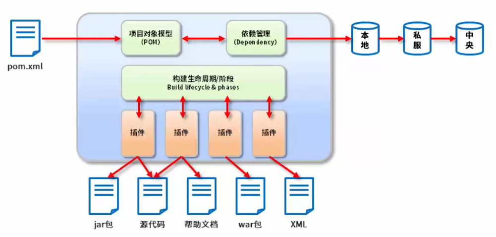

---

---

# Maven简介

## 什么是Maven以及Maven的作用

*   Maven的**本质是一个项目管理工具**，将项目开发和管理过程抽象成一个**项目对象模型**。
*   POM - Project Object Model 项目对象模型。
*   Maven除了**依赖管理，还可以进行项目构建**，依赖于构建生命周期。Maven提供了插件以实现构建生命周期/阶段。（有多个插件合作）
*   插件最终会给出jar包或者源代码。

补充说明：

-   项目构建：提供标准的、跨平台的自动化项目构建方式；
-   依赖管理：方便快捷的管理项目依赖的资源（jar包），避免资源间的版本冲突问题；
-   统一开发结构：提供标准的、统一的项目结构。

